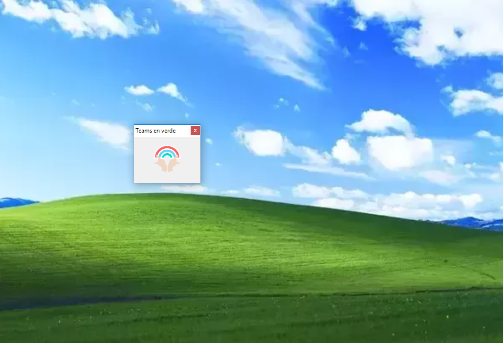

# EstoyDisponible es una aplicación destinada a evitar el cambio de estado en MS Teams

Mientras hago teletrabajo en cuarentena es normal que realice llamados telefónicos o anotaciones fuera de la computadora. Por tal motivo luego de unos pocos minutos el estado de MS Teams cambia a 'Ausente' aunque me encuentre al lado de mi computadora. Esto genera que mis colegas no me escriban pensando que no me encuentro disponible.
Para evitar esta situación desarrollé en unos minutos esta aplicación destinada a evitar el cambio automático de estado.

El código esta desarrollado en Visual Studio Community 2019 C# con Windows Forms

Funciona de una manera muy sencilla. Simplemente ejecute el archivo **Teams en verde.exe** en la carpeta [wf_mouse/bin/Release/](https://github.com/leonelcra/EstoyDisponible/tree/master/WF_mouse/bin/Release) descargado en su computadora y listo !

Screenshot

Mientras se encuentre ejecutandose la aplicación, el estado de MS Teams será Disponible y el protector de pantalla no se activará.

## Instrucciones de instalación:
###### Si sos programador cloná el proyecto y compilalo

###### Si no sabes que estas haciendo aca:
1. Descargá el archivo .zip y descomprimilo en tu computadora
2. Ejectutá el archivo **Teams en verde.exe** en la carpeta __wf_mouse/bin/Release/__

## Preguntas Frecuentes
Cuanto cuesta? Es gratis

En que sistema operativo funciona ? Esta probado en windows 10

No me funciona. Que hago ? Ni idea

Puedo sugerir funcionalidades ? Si, pero nunca van a ocurrir

Estan previstas nuevas versiones? No

No le estas poniendo ganas. No
